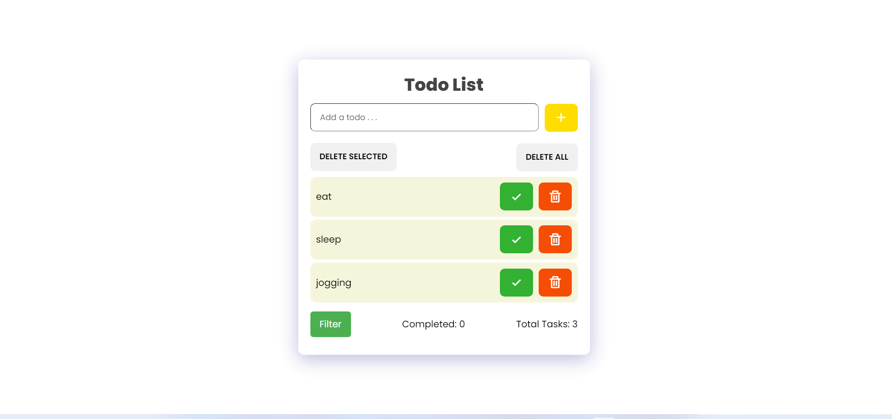

# TodoList

An easy-to-use to-do list tool that lets you mark and unmark things to indicate whether they have been finished or not Various categories can be used to view tasks.


## View app at
#### [Todo-List](https://salonee-jain.github.io/TodoList/)


<hr />

### Installation Options

```
git clone https://github.com/Salonee-Jain/TodoList.git
```
or

Simply download the Zip File and run on your system
<hr />


### Preview of the app
  